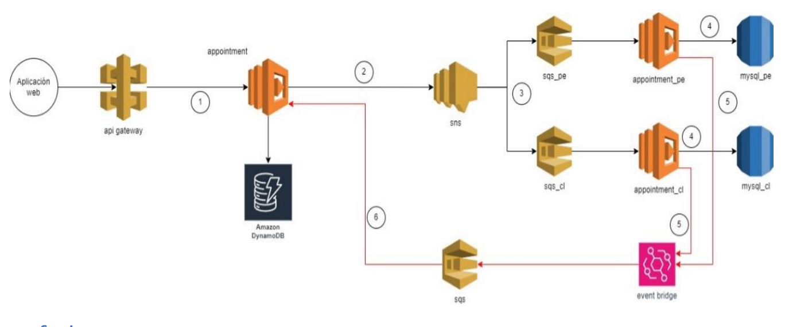

# Medical Appointment Backend

Sistema de agendamiento de citas médicas para asegurados en Perú y Chile, implementado en AWS con enfoque en escalabilidad, mantenimiento y buenas prácticas.

---

## Descripción del negocio

Un asegurado desea agendar una cita médica desde una aplicación web. La aplicación permite seleccionar:

- Centro médico
- Especialidad
- Médico
- Fecha y hora

La petición se procesa de forma distinta por país (Perú 🇵🇪 y Chile 🇨🇱), y el backend se encarga de orquestar los servicios necesarios.

---

## Arquitectura

La solución utiliza servicios serverless de AWS como Lambda, SNS, SQS, DynamoDB, RDS y EventBridge.



### Pasos del flujo

1. La aplicación web envía una solicitud al API Gateway.
2. Lambda `appointment` guarda la cita como `pending` en DynamoDB.
3. Publica en un tópico SNS con filtros por país (`PE`, `CL`).
4. El SNS enruta al SQS correspondiente.
5. Lambdas `appointment_pe` o `appointment_cl` procesan y almacenan en MySQL (RDS).
6. Se emite un evento por EventBridge, que llega a un SQS final.
7. Lambda `appointment` actualiza la cita como `completed` en DynamoDB.

---

## Tecnologías y herramientas

- Node.js + TypeScript
- Serverless Framework
- AWS Lambda, SNS, SQS, EventBridge, DynamoDB, RDS
- Jest (tests unitarios)
- Arquitectura limpia (Clean Architecture)
- Principios SOLID
- Patrón Repository y Publisher

---

## Estructura del proyecto

src/
├── application/ # Lógica de aplicación
├── domain/ # Modelos de dominio
├── handlers/ # Lambdas expuestas
├── infrastructure/ # Conexiones a AWS y bases de datos
└── tests/ # Pruebas unitarias

---

## Endpoints

### POST `/appointments`
Registrar una nueva cita médica.

**Request body:**
```json
{
  "insuredId": "01234",
  "scheduleId": 100,
  "countryISO": "PE"
}
```
**Response body:**
```json
{
  "message": "Appointment scheduling in process"
}
```
### GET `/appointments/{insuredId}`
Consultar todas las citas de un asegurado.

**Response body:**
```json
[
  {
    "insuredId": "01234",
    "scheduleId": 100,
    "countryISO": "PE",
    "status": "completed"
  }
]
```
## Pruebas
```txt
npm install
npm test
```
## Despliegue
1. Configura tus credenciales de AWS.
2. Modifica el archivo .env con los valores requeridos (credenciales RDS).
3. Despliega con Serverless Framework:
```txt
sls deploy --stage dev
```
